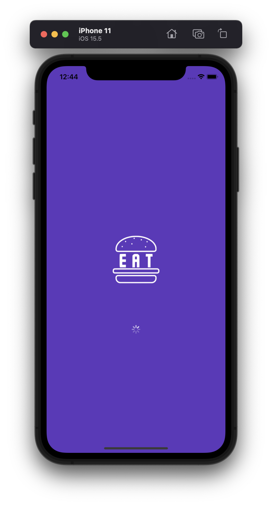
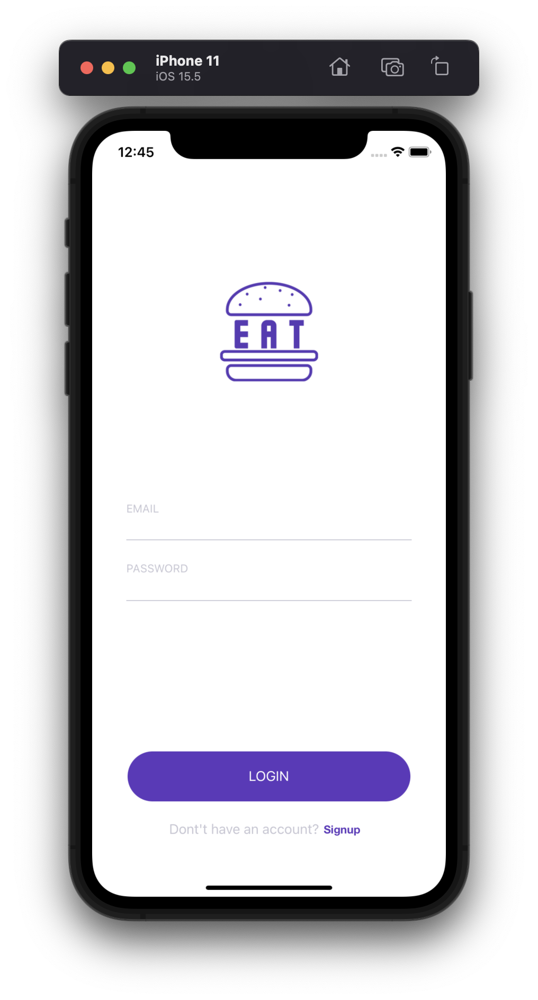
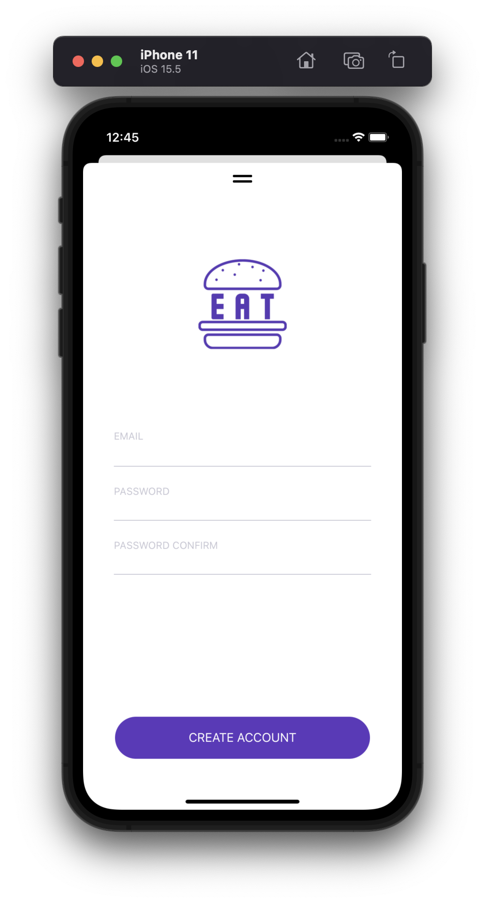
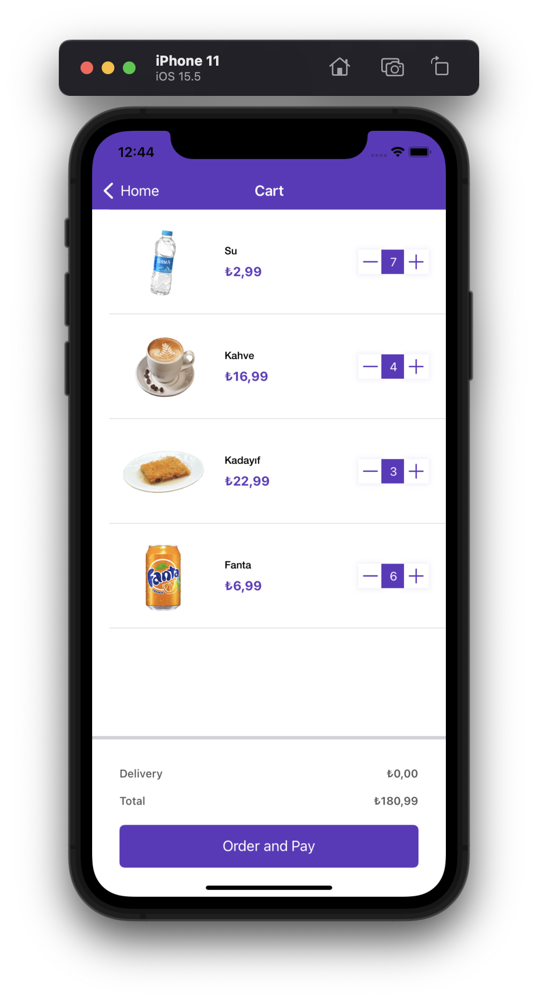
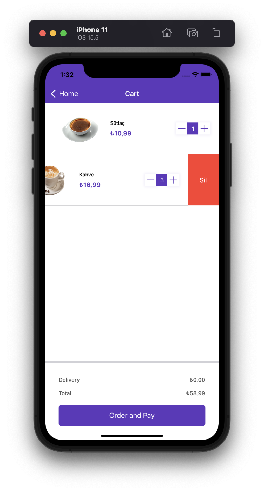
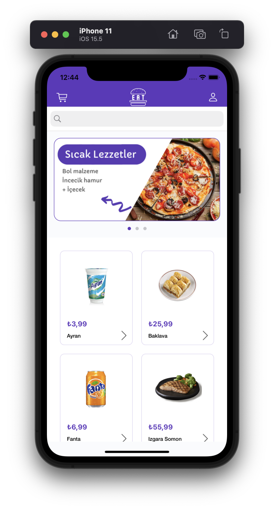
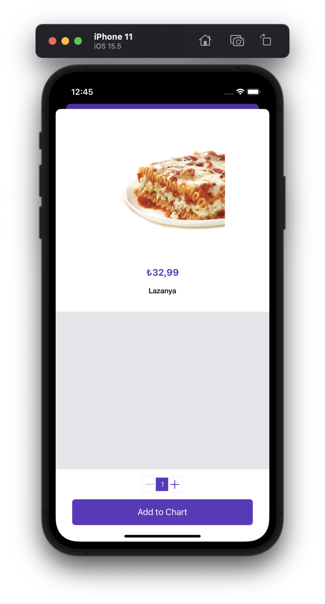

# Food App

#### About App
- Simple food app with see foods, search foods, food details, add food to cart, login and register operations.

### iOS:
- Collection View
- TableView
- Delegate
- Protocol
- SearchBar
- Enum
- Alert

### Architecture:
- VIPER Architecture

### Service:
- Rest API
- Firebase Auth

### 3rd Party Libraries:
- Alamofire
- Kingfisher

